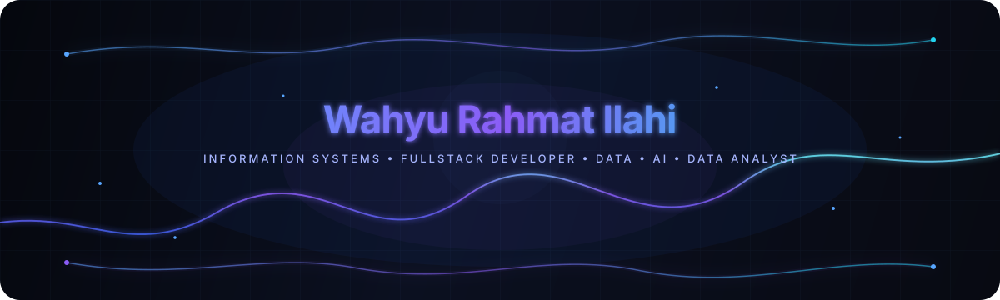

<!-- ========================================= -->
<!-- HERO -->
<!-- ========================================= -->

 

  <strong>
    Building practical digital solutions with modern technologies.
  </strong>

 

<!-- ========================================= -->
<!-- SOCIAL LINKS -->
<!-- ========================================= -->

 

<!-- ========================================= -->
<!-- PROFILE VIEWS -->
<!-- ========================================= -->

 

---

### About Me

Halo! Saya mahasiswa **Sistem Informasi di UIN Imam Bonjol Padang** dengan ketertarikan pada pengembangan aplikasi, backend engineering, cloud computing, dan penerapan Generative AI.

Saya senang membangun solusi digital yang tidak hanya berfungsi, tetapi juga memiliki arsitektur yang terstruktur, antarmuka yang modern, dan pengalaman pengguna yang baik.

 
  

###  Tentang Saya
Halo! Saya seorang mahasiswa Sistem Informasi di UIN Imam Bonjol Padang. Saya memiliki minat yang besar dalam dunia pengembangan aplikasi dan senang mengeksplorasi berbagai teknologi baru. Fokus saya saat ini adalah membangun sistem yang rapi, efisien, dan bermanfaat.

  

<!-- ========================================= -->
<!-- TECH STACK & TOOLS -->
<!-- ========================================= -->

 

<h2>Tech Stack & Tools</h2>

  
    Technologies and tools I use across development, data, AI, and cloud.
  

 

<!-- ========================================= -->
<!-- FRONTEND -->
<!-- ========================================= -->

<h3>Frontend</h3>

<table align="center" border="0" cellspacing="0" cellpadding="0">
<tr>

<td align="center" style="padding: 0 8px;">
  
</td>

<td align="center" style="padding: 0 8px;">
  
</td>

<td align="center" style="padding: 0 8px;">
  
</td>

<td align="center" style="padding: 0 8px;">
  
</td>

<td align="center" style="padding: 0 8px;">
  
</td>

<td align="center" style="padding: 0 8px;">
  
</td>

</tr>
</table>

  

<!-- ========================================= -->
<!-- BACKEND & FRAMEWORKS -->
<!-- ========================================= -->

<h3>Backend & Frameworks</h3>

<table align="center" border="0" cellspacing="0" cellpadding="0">
<tr>

<td align="center" style="padding: 0 8px;">
  
</td>

<td align="center" style="padding: 0 8px;">
  
</td>

<td align="center" style="padding: 0 8px;">
  
</td>

<td align="center" style="padding: 0 8px;">
  
</td>

<td align="center" style="padding: 0 8px;">
  
</td>

</tr>
</table>

  

<!-- ========================================= -->
<!-- DATABASE -->
<!-- ========================================= -->

<h3>Database</h3>

<table align="center" border="0" cellspacing="0" cellpadding="0">
<tr>

<td align="center" style="padding: 0 8px;">
  
</td>

<td align="center" style="padding: 0 8px;">
  
</td>

</tr>
</table>

  

<!-- ========================================= -->
<!-- MOBILE, TOOLS & CLOUD -->
<!-- ========================================= -->

<h3>Mobile, Tools & Cloud</h3>

<table align="center" border="0" cellspacing="0" cellpadding="0">
<tr>

<td align="center" style="padding: 0 8px;">
  
</td>

<td align="center" style="padding: 0 8px;">
  
</td>

<td align="center" style="padding: 0 8px;">
  
</td>

<td align="center" style="padding: 0 8px;">
  
</td>

<td align="center" style="padding: 0 8px;">
  
</td>

<td align="center" style="padding: 0 8px;">
  
</td>

</tr>
</table>

  

<!-- ========================================= -->
<!-- GITHUB STATISTICS -->
<!-- ========================================= -->

 
 

<h2>GitHub Statistics</h2>

  
    A glimpse into my coding activity, contributions, and development journey.
  

 

<!-- ========================================= -->
<!-- STATS CARDS -->
<!-- ========================================= -->

<table align="center" border="0" cellspacing="0" cellpadding="0">
<tr>

<!-- GitHub Stats -->

<td align="center" width="50%">

</td>

<!-- Top Languages -->

<td align="center" width="50%">

</td>

</tr>
</table>

 
 

<!-- ========================================= -->
<!-- GITHUB STREAK -->
<!-- ========================================= -->

 
 

<!-- ========================================= -->
<!-- ACTIVITY BADGES -->
<!-- ========================================= -->

 
 

  

###  Mari Terhubung

  
  
  

  

